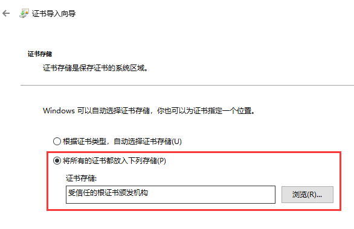
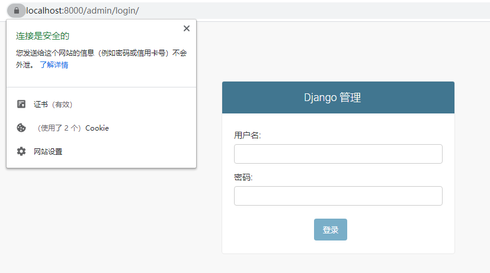

# django 使用 SSL 服务器

## 准备工作

### 创建证书

使用下面方式创建新的CA证书：

创建req.cnf文件，复制粘贴下面的配置

    [req]
    distinguished_name = req_distinguished_name
    x509_extensions = v3_req
    prompt = no

    [req_distinguished_name]
    C = CN
    ST = Guangdong
    L = SomeCity
    O = MyCompany
    OU = MyDivision
    CN = localhost

    [v3_req]
    keyUsage = critical, digitalSignature, keyAgreement
    extendedKeyUsage = serverAuth
    subjectAltName = @alt_names

    [alt_names]
    DNS.1 = localhost
    IP.1 = 127.0.0.1

之后使用下面语句生成CA证书。

    openssl req -x509 -nodes -days 3650 -newkey rsa:2048 -keyout ca/ca-key.pem -out ca/ca-cert.pem -config req.cnf -sha256

### 导入证书

浏览器导入 `cert/ca.p12` 证书到「受信任的根证书颁发机构」里。

双击 `cert/ca.p12` 文件，点击下一步直到下面的界面，选择「受信任的根证书颁发机构」，最后点击下一步直到完成。导入完成之后浏览器就不再显示安全警告。

## 快速开始

    pipenv install
    pipenv shell

    python manage.py runsslserver

    python manage.py runsslserver --certificate cert/ca-cert.pem --key cert/ca-key.pem

## 效果图

