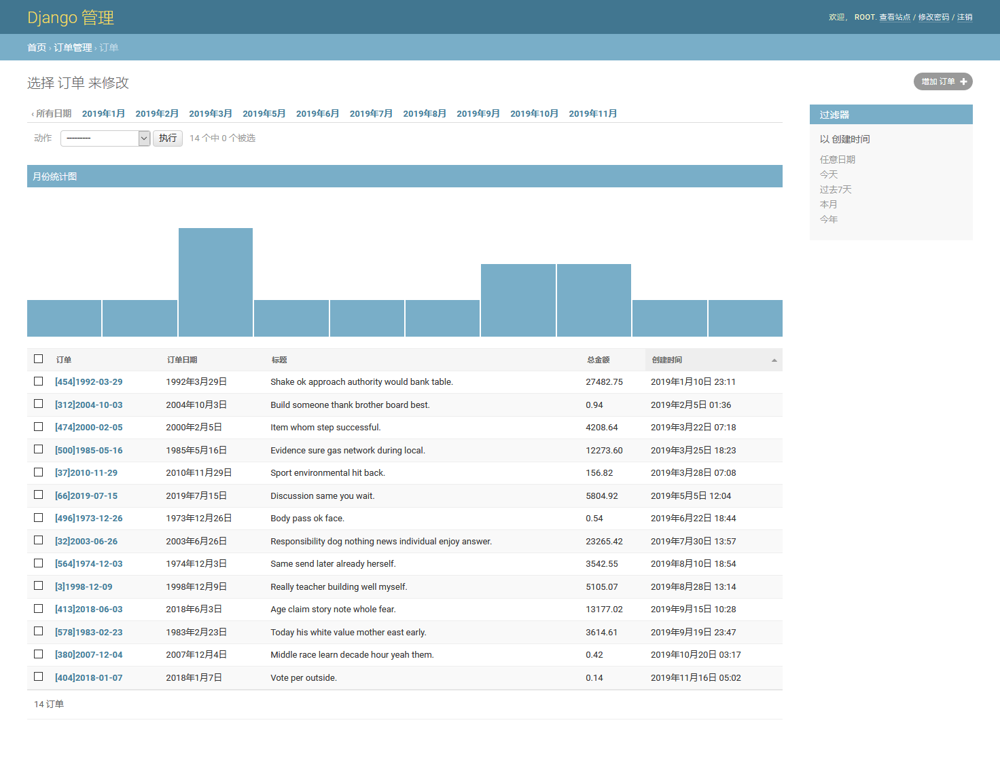

# Django简易统计页面

## 快速开始

    python manage.py migrate
    python manage.py createsuperuser
    python manage.py seed order --number=200
    python manage.py runserver

## 已知BUG

- django admin 中的 date_hierarchy 显示可能有时区bug

## 效果图

